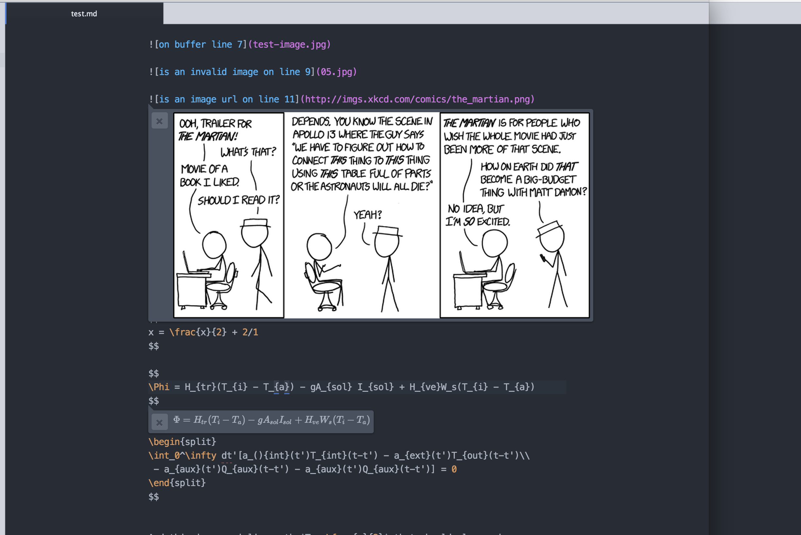

# Preview LaTeX maths and Images inline

**Requires pandoc flavor markdown (`language-pfm` package)**

Preview Latex formula and images embedded directly in your documents - no need to generate a full PDF or HTML preview to check your figures and formula!

This project is intended to be part of a larger suite of tools for markdown for academic writing.

# Install

Requires pandoc flavor markdown (`language-pfm` package)

# Contribute

Contributions via pull request are welcome.

## TODO

Non-exhaustive todo list:

- [ ] better support for non-markdown files
- [ ] MathJax fallback for maths that KaTeX can't handle
- [ ] Live update of maths as you type with small delay
- [ ] Display preview as inline block instead of overlay (?)
- [ ] More test coverage
